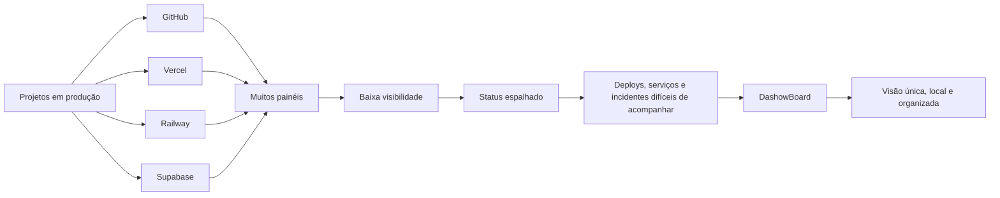
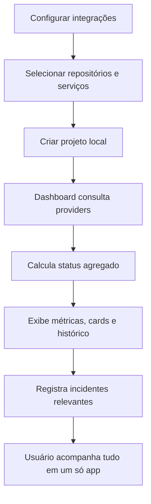
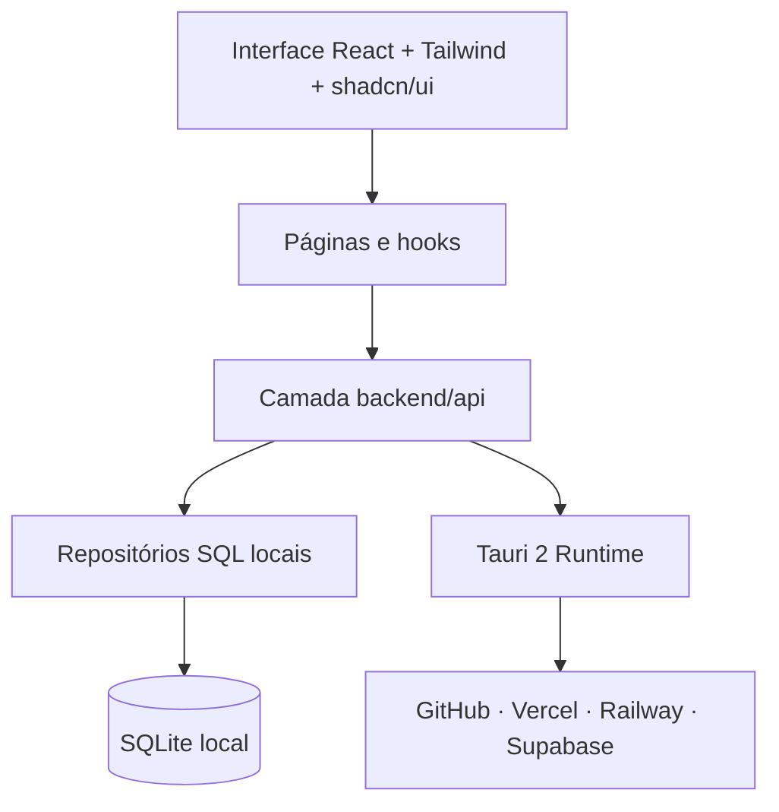
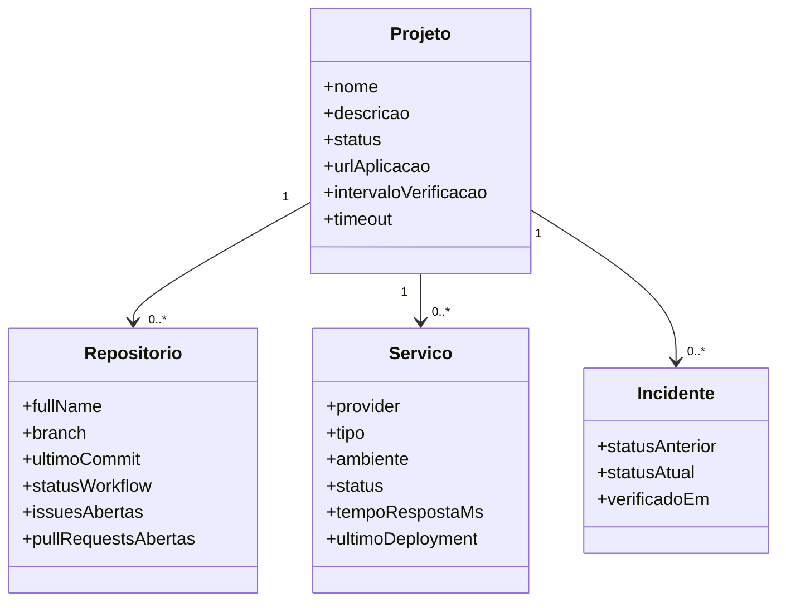
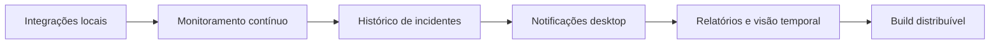

<div align="center">

# 🧭 DashowBoard

### Um cockpit desktop para monitorar projetos, serviços, deploys e incidentes em um só lugar.

<p>
  
  
  
  
  
  
</p>

<p>
  
  
  
  
</p>

</div>

---

## ✨ Sobre o projeto

**DashowBoard** é um aplicativo desktop pessoal criado para centralizar a visão operacional de projetos espalhados entre **GitHub, Vercel, Railway e Supabase**.

A ideia é transformar vários painéis separados em um único cockpit local, onde seja possível acompanhar o estado dos projetos, repositórios, serviços, deploys, disponibilidade e incidentes sem precisar abrir várias abas ou dashboards externos.

> O foco atual do app é **consultar, organizar e monitorar**. Ele não administra, exclui ou altera recursos remotos sem ação explícita.

---

## 🧠 O problema que ele resolve



---

## 🕹️ Funcionalidades

| Área | O que o DashowBoard faz |
|---|---|
| 📊 **Visão geral** | Exibe métricas agregadas dos projetos monitorados. |
| 🧩 **Projetos** | Agrupa repositórios, serviços, providers e configurações locais. |
| 🚦 **Status** | Classifica serviços como saudável, degradado, offline, atualizando ou desconhecido. |
| ⚠️ **Incidentes** | Registra mudanças relevantes de estado, sem duplicar o mesmo problema repetidamente. |
| 🔌 **Integrações** | Conecta GitHub, Vercel, Railway e Supabase via tokens locais. |
| 🗂️ **SQLite local** | Persiste projetos, vínculos, histórico e configurações no ambiente desktop. |
| 🔔 **Notificações** | Estrutura preparada para avisos locais via Tauri. |
| 🧪 **Filtros** | Permite filtrar projetos por nome, status, provider, tipo de serviço e tag. |

---

## 🧭 Fluxo de uso



---

## 🏗️ Arquitetura



---

## 🧱 Stack principal

### Frontend

<p>
  
  
  
  
  
</p>

### Desktop e Runtime

<p>
  
  
  
</p>

### Dados, estado e UI

<p>
  
  
  
  
  
</p>

---

## 📌 Modelo de domínio



---

## 📂 Estrutura do projeto

```txt
src/
  backend/
    api/
      controllers/     # hooks e queries da camada de dados
      integrations/    # integrações com providers externos
      models/          # contratos e tipos da aplicação
      enums/           # domínios de status, providers, tipos e tags

  components/          # componentes reutilizáveis
  pages/               # telas, hooks, schemas, modais e componentes locais
  lib/                 # config, hooks, helpers e tipos globais
  routes/              # rotas da aplicação

src-tauri/
  src/                 # comandos, integrações nativas e runtime Tauri
  Cargo.toml           # dependências Rust/Tauri
```

---

## 🔐 Segurança

- Tokens são tratados como configuração local.
- Nenhum token deve ser exposto em variáveis `VITE_*`, logs ou bundle do frontend.
- O app consulta dados externos, mas não remove ou publica recursos remotamente por padrão.
- O SQLite armazena vínculos locais, histórico e configurações do dashboard.

---

## ▶️ Como rodar localmente

### 1. Instale as dependências

```bash
pnpm install
```

### 2. Rode em modo web

```bash
pnpm dev
```

### 3. Rode como app desktop Tauri

```bash
pnpm tauri dev
```

### 4. Gere build de produção

```bash
pnpm build
pnpm tauri build
```

---

## 🧪 Scripts disponíveis

| Comando | Descrição |
|---|---|
| `pnpm dev` | Inicia o Vite em modo desenvolvimento. |
| `pnpm build` | Executa checagem TypeScript e gera build web. |
| `pnpm preview` | Serve o build localmente. |
| `pnpm tauri` | Executa comandos do Tauri CLI. |

---

## 🧭 Roadmap



---

## 🎯 Objetivo técnico

Este projeto foi criado para explorar uma arquitetura desktop moderna com **React + Tauri + SQLite**, aplicando conceitos de:

- monitoramento de aplicações;
- organização de projetos reais;
- integração com APIs externas;
- persistência local;
- modelagem de status e incidentes;
- UX para produtos de operação e observabilidade.

---

## 👨‍💻 Autor

Desenvolvido por **Enzo Caetano Rodrigues**.

<p>
  <a href="https://github.com/EnzoCaetano015">
    
  </a>
  <a href="https://www.caetanodev.com/">
    
  </a>
  <a href="https://www.linkedin.com/in/enzo-caetano-814736290/">
    
  </a>
</p>

---

<div align="center">

### DashowBoard

**Menos abas abertas. Mais visão sobre seus projetos.**

</div>
