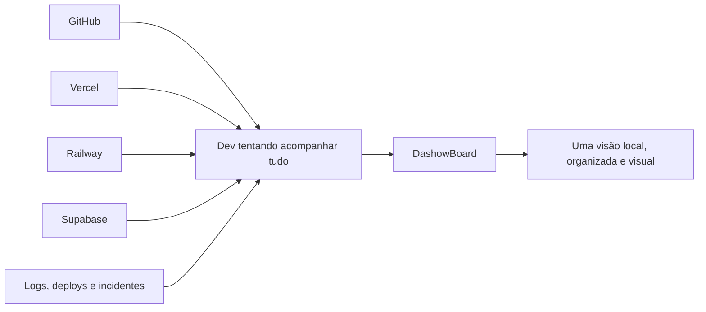
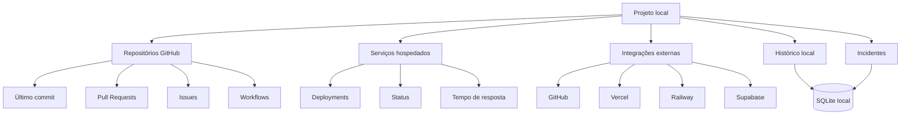
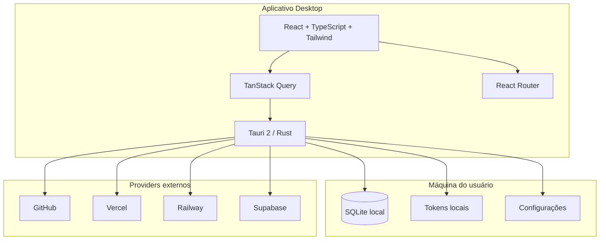
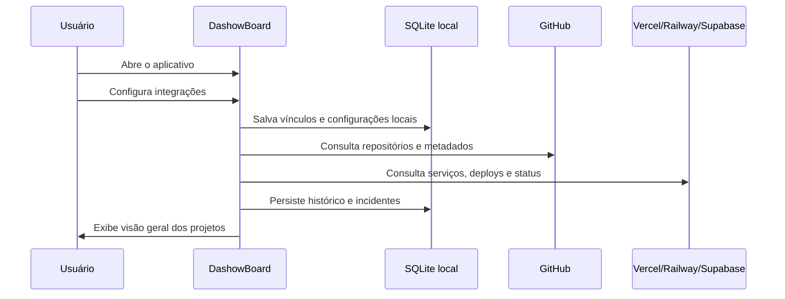
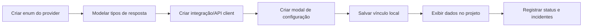
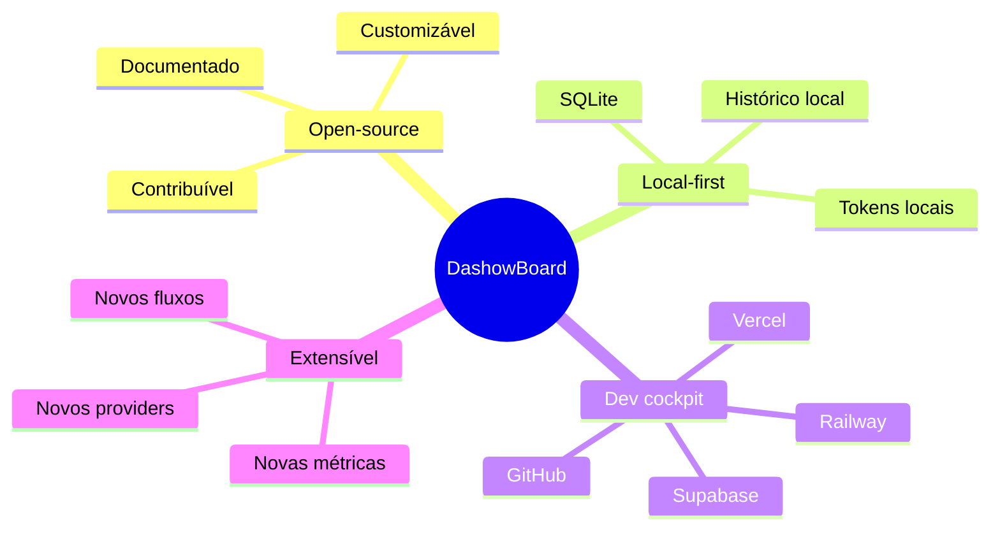

<div align="center">

# 🛰️ DashowBoard

### Seu cockpit open-source para acompanhar projetos, deploys, serviços e incidentes em um só lugar.


</div>

---

## ✨ O que é o DashowBoard?

O **DashowBoard** é um aplicativo desktop open-source criado para centralizar a visibilidade de projetos que vivem espalhados entre **GitHub**, **Vercel**, **Railway** e **Supabase**.

A ideia é simples: qualquer pessoa pode clonar o projeto, rodar localmente, gerar seu próprio instalador, conectar suas contas e usar o DashowBoard como um painel pessoal para acompanhar:

- repositórios;
- serviços;
- deploys;
- bancos de dados;
- incidentes;
- disponibilidade;
- histórico local;
- status geral dos projetos.

Ele não foi pensado para ser só um app fechado. A proposta é ser uma base **customizável**, **contribuível** e **extensível**, onde devs podem adaptar o visual, adicionar novos providers, criar novas métricas e transformar o dashboard em algo próprio.

---

## 🧭 Por que esse projeto existe?

Quem desenvolve muitos projetos normalmente precisa abrir várias abas para entender o estado de tudo:



O DashowBoard nasce para reduzir essa bagunça e transformar vários pontos soltos em uma visão única.

---

## 🚀 Principais recursos

| Área | O que o app faz |
|---|---|
| 📊 Visão geral | Exibe métricas agregadas dos projetos e serviços monitorados. |
| 🧩 Projetos | Permite agrupar repositórios, serviços, deploys e integrações em projetos locais. |
| 🔌 Integrações | Conecta tokens e contas de providers como GitHub, Vercel, Railway e Supabase. |
| 🚨 Incidentes | Registra mudanças relevantes de estado, como online → offline ou erro em deploy. |
| 💾 Persistência local | Usa SQLite local pelo runtime do Tauri. |
| 🖥️ Desktop app | Pode ser empacotado como aplicativo instalável. |
| 🧑‍💻 Open-source | Qualquer pessoa pode estudar, modificar, contribuir e customizar. |

---

## 🧠 Como o DashowBoard enxerga o mundo



### Conceitos principais

| Conceito | Significado |
|---|---|
| **Projeto** | Agrupador local criado pelo usuário para organizar recursos relacionados. |
| **Repositório** | Código hospedado no GitHub, como frontend, API, worker, biblioteca ou documentação. |
| **Serviço** | Recurso executado em algum provider, como frontend, API, banco, worker ou cron job. |
| **Integração** | Vínculo entre o projeto local e um recurso externo. |
| **Incidente** | Mudança relevante de estado, não apenas qualquer erro temporário. |
| **Status** | Estado agregado do projeto ou serviço: saudável, degradado, offline, atualizando ou desconhecido. |

---

## 🏗️ Arquitetura

O projeto combina frontend web moderno com runtime desktop nativo:



### Camadas principais

```txt
src/
  backend/
    api/
      controllers/      # hooks e chamadas com TanStack Query
      integrations/     # comunicação com providers externos
      models/           # contratos e tipos de resposta
      enums/            # providers, status, tipos e domínios

  components/           # componentes reutilizáveis da interface
  pages/                # páginas, hooks, schemas, modais e componentes locais
  lib/                  # configs, hooks compartilhados, utils e tipos globais
  routes/               # rotas da aplicação

src-tauri/
  src/                  # comandos Rust, runtime nativo e integrações locais
  Cargo.toml            # dependências do app Tauri
```

---

## 🛠️ Stack

### Frontend

- React 19
- TypeScript
- Vite
- React Router
- TanStack Query
- Tailwind CSS
- shadcn/ui
- Lucide React
- Recharts
- Sonner

### Desktop / Runtime nativo

- Tauri 2
- Rust
- SQLite via plugin SQL do Tauri
- Plugin HTTP do Tauri
- Plugin de notificações
- Plugin de autostart
- Keyring nativo por sistema operacional

### Integrações previstas / utilizadas

- GitHub
- Vercel
- Railway
- Supabase

---

## 🔐 Segurança e tokens

O DashowBoard é pensado para funcionar localmente. Tokens de integração devem ser tratados como configuração sensível.

Regras importantes:

- não coloque tokens direto no código;
- não exponha tokens em variáveis `VITE_*`;
- não suba `.env` com credenciais;
- não registre tokens em logs;
- prefira armazenamento local seguro via runtime nativo;
- contribuições que exponham segredos não serão aceitas.

---

## 📦 Como rodar localmente

### 1. Clone o repositório

```bash
git clone https://github.com/EnzoCaetano015/DashowBoard.git
cd DashowBoard
```

### 2. Instale as dependências

```bash
pnpm install
```

### 3. Rode em modo web

```bash
pnpm dev
```

Esse modo abre a interface no navegador, mas alguns recursos locais dependem do runtime desktop do Tauri.

### 4. Rode como aplicativo desktop

```bash
pnpm tauri dev
```

Esse é o modo recomendado para testar integrações, SQLite local e recursos nativos.

---

## 🏭 Como gerar um instalador

Depois de configurar o ambiente do Tauri na sua máquina, rode:

```bash
pnpm tauri build
```

O Tauri irá gerar os artefatos de instalação conforme o sistema operacional.

Exemplos de saída esperada:

```txt
src-tauri/target/release/bundle/
```

A partir disso, você pode instalar o app na sua máquina e usar o DashowBoard como seu próprio painel pessoal.

---

## 🔌 Como usar depois de instalado



Fluxo básico:

1. abra o aplicativo;
2. acesse **Integrações**;
3. conecte suas contas/tokens;
4. crie um projeto local;
5. associe repositórios e serviços;
6. acompanhe métricas, status, deploys e incidentes;
7. customize o app como quiser.

---

## 🎨 Como customizar

Você pode usar o DashowBoard como base para o seu próprio cockpit.

Ideias de customização:

- alterar tema, cores e identidade visual;
- adicionar novos cards de métricas;
- criar novas páginas;
- integrar novos providers;
- adicionar suporte a Docker, AWS, Azure, Render ou Fly.io;
- criar novas regras de incidente;
- melhorar gráficos e relatórios;
- gerar notificações locais mais inteligentes;
- adaptar o app para times pequenos ou uso pessoal.

---

## 🧩 Como adicionar um novo provider

Exemplo de fluxo esperado:



Checklist recomendado:

- adicionar provider no enum central;
- criar tipos em `src/backend/api/models`;
- criar integração em `src/backend/api/integrations`;
- criar hooks em `src/backend/api/controllers`;
- criar modal de configuração em `pages/Integracoes/modais`;
- persistir apenas vínculos e configurações locais;
- nunca executar ações destrutivas em recursos externos sem permissão explícita.

---

## 🤝 Como contribuir

Contribuições são bem-vindas.

Você pode contribuir com:

- correções de bug;
- melhorias visuais;
- novos cards de métricas;
- novas integrações;
- documentação;
- testes;
- melhorias de arquitetura;
- melhorias de acessibilidade;
- revisão de código;
- sugestões via issues.

### Fluxo de contribuição

```bash
# 1. Faça um fork
# 2. Clone seu fork
git clone https://github.com/SEU_USUARIO/DashowBoard.git

# 3. Crie uma branch
git checkout -b feature/minha-melhoria

# 4. Instale e rode
pnpm install
pnpm tauri dev

# 5. Faça suas alterações
# 6. Abra um Pull Request
```

### Boas práticas para Pull Requests

- explique o que foi alterado;
- inclua prints ou GIFs se mexeu na UI;
- mantenha o escopo pequeno;
- não refatore arquivos fora do contexto;
- não adicione bibliotecas sem necessidade;
- não exponha credenciais;
- siga a arquitetura atual;
- prefira componentes existentes antes de criar novos.

---

## 🧪 Scripts úteis

```bash
pnpm dev          # roda a interface com Vite
pnpm build        # gera build web com checagem TypeScript
pnpm preview      # pré-visualiza o build web
pnpm tauri dev    # roda como app desktop em desenvolvimento
pnpm tauri build  # gera instalador/app empacotado
```

---

## 🗺️ Roadmap

- [ ] Melhorar fluxo de onboarding inicial
- [ ] Finalizar integração com GitHub
- [ ] Finalizar integração com Vercel
- [ ] Finalizar integração com Railway
- [ ] Finalizar integração com Supabase
- [ ] Adicionar tela detalhada de incidentes
- [ ] Melhorar gráficos de disponibilidade
- [ ] Adicionar notificações locais configuráveis
- [ ] Criar documentação para novos providers
- [ ] Adicionar testes automatizados
- [ ] Preparar releases com instaladores
- [ ] Definir licença open-source

---

## 📌 Filosofia do projeto



O DashowBoard deve continuar sendo uma ferramenta para devs que querem enxergar melhor seus próprios projetos sem depender de um painel fechado.

---

## 👨‍💻 Autor

Desenvolvido por **Enzo Caetano**.

- GitHub: [@EnzoCaetano015](https://github.com/EnzoCaetano015)
- Portfólio: [caetanodev.com](https://www.caetanodev.com/)
- LinkedIn: [Enzo Caetano](https://www.linkedin.com/in/enzo-caetano-814736290/)

---

<div align="center">

### ⭐ Se esse projeto te ajudou, considere deixar uma estrela.

**Clone. Rode. Conecte suas contas. Customize. Contribua.**

</div>
